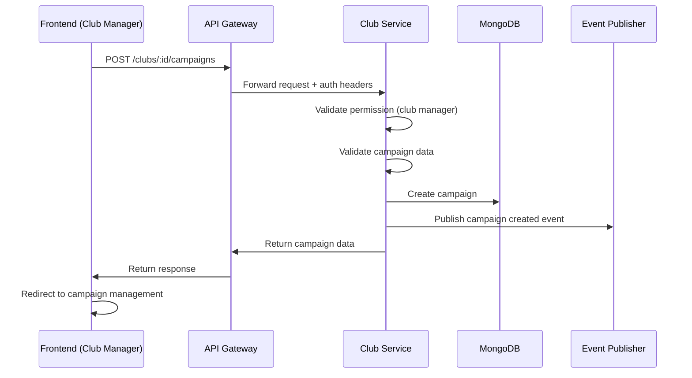

# Club Service - API Documentation & Implementation Guide

## Tổng quan

Club Service là microservice chịu trách nhiệm quản lý các câu lạc bộ và chiến dịch tuyển thành viên trong hệ thống Club Management. Service này cung cấp các tính năng tìm kiếm câu lạc bộ, quản lý thông tin câu lạc bộ, và quản lý các chiến dịch tuyển thành viên.

### Thông tin kỹ thuật
- **Port**: 3002
- **Base URL**: `http://localhost:3002/api`
- **Database**: MongoDB với Mongoose ODM
- **Authentication**: JWT từ API Gateway
- **Documentation**: Hiện tại chưa có Swagger, sẽ được update

---

## API Specifications

### Base Headers
Tất cả requests cần header từ API Gateway:
```http
X-API-Gateway-Secret: [SECRET_KEY]
```

Các endpoints cần authentication cần thêm:
```http
x-user-id: [USER_UUID]
x-user-role: [USER|ADMIN]
Authorization: Bearer [ACCESS_TOKEN]
```

---

## 1. Quản lý Câu lạc bộ (Club Management)

### 1.1 Tìm kiếm và lọc câu lạc bộ

#### API Endpoint
```http
GET /api/clubs
```

#### Query Parameters
```javascript
{
  search?: string,        // Tìm kiếm tổng quát
  name?: string,         // Tìm theo tên
  category?: string,     // Lọc theo danh mục
  location?: string,     // Lọc theo địa điểm
  sort?: string,         // Sắp xếp: name, name_desc, category, location, newest, oldest, relevance
  page?: number,         // Trang (mặc định: 1)
  limit?: number         // Số lượng/trang (mặc định: 10, tối đa: 100)
}
```

#### Response
```json
{
  "success": true,
  "message": "Clubs retrieved successfully",
  "data": {
    "total": 25,
    "page": 1,
    "totalPages": 3,
    "limit": 10,
    "results": [
      {
        "id": "club_id",
        "name": "Câu lạc bộ Công nghệ",
        "description": "Câu lạc bộ về công nghệ và lập trình",
        "category": "technology",
        "location": "Hà Nội",
        "logo_url": "https://example.com/logo.png",
        "status": "ACTIVE",
        "member_count": 50,
        "created_at": "2025-01-01T00:00:00.000Z",
        "manager": {
          "user_id": "manager_user_id",
          "full_name": "Nguyễn Văn A",
          "email": "manager@example.com"
        }
      }
    ]
  },
  "meta": {
    "searchParams": {},
    "timestamp": "2025-01-16T00:00:00.000Z"
  }
}
```

### Frontend Implementation

```javascript
const searchClubs = async (searchParams) => {
  try {
    const queryString = new URLSearchParams(searchParams).toString();
    const response = await fetch(`/api/clubs?${queryString}`, {
      headers: {
        'Content-Type': 'application/json'
      }
    });
    
    const result = await response.json();
    
    if (result.success) {
      return {
        clubs: result.data.results,
        pagination: {
          total: result.data.total,
          page: result.data.page,
          totalPages: result.data.totalPages,
          limit: result.data.limit
        }
      };
    }
  } catch (error) {
    console.error('Search clubs failed:', error);
    throw error;
  }
};

// Sử dụng trong component
const handleSearch = async () => {
  const searchData = await searchClubs({
    search: searchTerm,
    category: selectedCategory,
    location: selectedLocation,
    sort: sortBy,
    page: currentPage,
    limit: 12
  });
  
  setClubs(searchData.clubs);
  setPagination(searchData.pagination);
};
```

### 1.2 Lấy thông tin chi tiết câu lạc bộ

#### API Endpoint
```http
GET /api/clubs/:id
```

#### Response
```json
{
  "id": "club_id",
  "name": "Câu lạc bộ Công nghệ",
  "description": "Mô tả chi tiết về câu lạc bộ...",
  "category": "technology",
  "location": "Hà Nội",
  "contact_email": "contact@techclub.com",
  "contact_phone": "+84123456789",
  "logo_url": "https://example.com/logo.png",
  "website_url": "https://techclub.com",
  "social_links": {
    "facebook": "https://facebook.com/techclub",
    "instagram": "https://instagram.com/techclub"
  },
  "settings": {
    "is_public": true,
    "requires_approval": true,
    "max_members": 100
  },
  "status": "ACTIVE",
  "member_count": 50,
  "created_by": "creator_user_id",
  "manager": {
    "user_id": "manager_user_id",
    "full_name": "Nguyễn Văn A",
    "email": "manager@example.com",
    "assigned_at": "2025-01-01T00:00:00.000Z"
  }
}
```

### Frontend Implementation

```javascript
const getClubDetails = async (clubId) => {
  try {
    const response = await fetch(`/api/clubs/${clubId}`);
    const club = await response.json();
    
    if (response.ok) {
      return club;
    } else {
      throw new Error(club.message || 'Club not found');
    }
  } catch (error) {
    console.error('Get club details failed:', error);
    throw error;
  }
};

// Sử dụng trong component
useEffect(() => {
  const loadClubDetails = async () => {
    try {
      setLoading(true);
      const club = await getClubDetails(clubId);
      setClubData(club);
    } catch (error) {
      setError(error.message);
    } finally {
      setLoading(false);
    }
  };
  
  loadClubDetails();
}, [clubId]);
```

### 1.3 Tạo câu lạc bộ mới (Admin only)

#### API Endpoint
```http
POST /api/clubs
```

#### Headers
```http
x-user-id: [ADMIN_USER_ID]
x-user-role: admin
Authorization: Bearer [ACCESS_TOKEN]
```

#### Request Body
```json
{
  "name": "Câu lạc bộ Mới",
  "description": "Mô tả câu lạc bộ",
  "category": "technology",
  "location": "Hà Nội",
  "contact_email": "contact@newclub.com",
  "contact_phone": "+84123456789",
  "logo_url": "https://example.com/logo.png",
  "website_url": "https://newclub.com",
  "social_links": {
    "facebook": "https://facebook.com/newclub"
  },
  "settings": {
    "is_public": true,
    "requires_approval": true,
    "max_members": 50
  },
  "manager_user_id": "manager_user_id",
  "manager_full_name": "Nguyễn Văn B",
  "manager_email": "manager@example.com"
}
```

#### Response
```json
{
  "success": true,
  "message": "Club created successfully with manager assigned",
  "data": {
    "club": {
      "id": "new_club_id",
      "name": "Câu lạc bộ Mới",
      "category": "technology",
      "status": "ACTIVE",
      "manager": {
        "user_id": "manager_user_id",
        "full_name": "Nguyễn Văn B",
        "email": "manager@example.com",
        "assigned_at": "2025-01-16T00:00:00.000Z"
      }
    },
    "manager": {
      "user_id": "manager_user_id",
      "full_name": "Nguyễn Văn B",
      "email": "manager@example.com"
    }
  }
}
```

### Frontend Implementation (Admin Panel)

```javascript
const createClub = async (clubData) => {
  try {
    const response = await fetch('/api/clubs', {
      method: 'POST',
      headers: {
        'Content-Type': 'application/json',
        'Authorization': `Bearer ${localStorage.getItem('accessToken')}`
      },
      body: JSON.stringify(clubData)
    });
    
    const result = await response.json();
    
    if (result.success) {
      showSuccess('Câu lạc bộ đã được tạo thành công!');
      return result.data.club;
    } else {
      throw new Error(result.message);
    }
  } catch (error) {
    console.error('Create club failed:', error);
    throw error;
  }
};

// Form validation
const validateClubForm = (formData) => {
  const errors = {};
  
  if (!formData.name?.trim()) {
    errors.name = 'Tên câu lạc bộ là bắt buộc';
  }
  
  if (!formData.category) {
    errors.category = 'Danh mục là bắt buộc';
  }
  
  if (!formData.manager_user_id) {
    errors.manager_user_id = 'Quản lý câu lạc bộ là bắt buộc';
  }
  
  if (formData.contact_email && !isValidEmail(formData.contact_email)) {
    errors.contact_email = 'Email không hợp lệ';
  }
  
  return {
    isValid: Object.keys(errors).length === 0,
    errors
  };
};
```

### 1.4 Lấy danh sách Categories và Locations

#### Get Categories
```http
GET /api/clubs/categories
```

```json
{
  "success": true,
  "message": "Categories retrieved successfully",
  "data": ["academic", "sports", "arts", "technology", "social", "volunteer", "cultural", "other"]
}
```

#### Get Locations
```http
GET /api/clubs/locations
```

```json
{
  "success": true,
  "message": "Locations retrieved successfully", 
  "data": ["Hà Nội", "TP.HCM", "Đà Nẵng", "Cần Thơ"]
}
```

#### Get Statistics
```http
GET /api/clubs/stats
```

```json
{
  "success": true,
  "message": "Club statistics retrieved successfully",
  "data": {
    "totalClubs": 25,
    "categories": ["technology", "sports", "arts"],
    "locations": ["Hà Nội", "TP.HCM"],
    "averageSize": 45.5
  }
}
```

---

## 2. Quản lý Chiến dịch Tuyển thành viên (Recruitment Campaigns)

### 2.1 Tạo chiến dịch tuyển thành viên

#### API Endpoint
```http
POST /api/clubs/:clubId/campaigns
```

#### Headers
```http
x-user-id: [USER_ID]
x-user-role: [USER_ROLE]
Authorization: Bearer [ACCESS_TOKEN]
```

#### Request Body
```json
{
  "title": "Tuyển thành viên mùa Thu 2025",
  "description": "Chiến dịch tuyển thành viên cho học kỳ mới",
  "requirements": [
    "Sinh viên năm 2-4",
    "Có kinh nghiệm lập trình",
    "Có thời gian tham gia hoạt động"
  ],
  "application_questions": [
    {
      "id": "q1",
      "question": "Kinh nghiệm lập trình của bạn?",
      "type": "textarea",
      "required": true
    },
    {
      "id": "q2", 
      "question": "Tại sao bạn muốn tham gia?",
      "type": "textarea",
      "required": true
    }
  ],
  "start_date": "2025-02-01T00:00:00.000Z",
  "end_date": "2025-02-28T23:59:59.000Z",
  "max_applications": 100,
  "status": "draft"
}
```

#### Response
```json
{
  "success": true,
  "message": "Campaign created as draft successfully",
  "data": {
    "id": "campaign_id",
    "club_id": "club_id",
    "title": "Tuyển thành viên mùa Thu 2025",
    "description": "Chiến dịch tuyển thành viên cho học kỳ mới",
    "status": "draft",
    "start_date": "2025-02-01T00:00:00.000Z",
    "end_date": "2025-02-28T23:59:59.000Z",
    "max_applications": 100,
    "statistics": {
      "total_applications": 0,
      "approved_applications": 0,
      "rejected_applications": 0,
      "pending_applications": 0
    },
    "created_by": "user_id",
    "created_at": "2025-01-16T00:00:00.000Z"
  }
}
```

### Flow Implementation cho Frontend



### Frontend Implementation

```javascript
const createCampaign = async (clubId, campaignData) => {
  try {
    const response = await fetch(`/api/clubs/${clubId}/campaigns`, {
      method: 'POST',
      headers: {
        'Content-Type': 'application/json',
        'Authorization': `Bearer ${localStorage.getItem('accessToken')}`
      },
      body: JSON.stringify(campaignData)
    });
    
    const result = await response.json();
    
    if (result.success) {
      showSuccess(result.message);
      return result.data;
    } else {
      throw new Error(result.message);
    }
  } catch (error) {
    console.error('Create campaign failed:', error);
    throw error;
  }
};

// Campaign form component
const CampaignForm = ({ clubId, onSubmit }) => {
  const [formData, setFormData] = useState({
    title: '',
    description: '',
    requirements: [''],
    application_questions: [
      { id: 'q1', question: '', type: 'text', required: false }
    ],
    start_date: '',
    end_date: '',
    max_applications: 50,
    status: 'draft'
  });

  const handleSubmit = async (e) => {
    e.preventDefault();
    
    const validation = validateCampaignForm(formData);
    if (!validation.isValid) {
      setErrors(validation.errors);
      return;
    }
    
    try {
      const campaign = await createCampaign(clubId, formData);
      onSubmit(campaign);
    } catch (error) {
      setError(error.message);
    }
  };

  const addQuestion = () => {
    setFormData(prev => ({
      ...prev,
      application_questions: [
        ...prev.application_questions,
        { 
          id: `q${prev.application_questions.length + 1}`,
          question: '',
          type: 'text',
          required: false
        }
      ]
    }));
  };

  return (
    <form onSubmit={handleSubmit}>
      {/* Form fields */}
    </form>
  );
};
```

### 2.2 Quản lý trạng thái chiến dịch

#### Publish Campaign
```http
POST /api/clubs/:clubId/campaigns/:campaignId/publish
```

#### Pause Campaign
```http
POST /api/clubs/:clubId/campaigns/:campaignId/pause
```

#### Resume Campaign
```http
POST /api/clubs/:clubId/campaigns/:campaignId/resume
```

#### Complete Campaign
```http
POST /api/clubs/:clubId/campaigns/:campaignId/complete
```

### Frontend Implementation

```javascript
const updateCampaignStatus = async (clubId, campaignId, action) => {
  try {
    const response = await fetch(`/api/clubs/${clubId}/campaigns/${campaignId}/${action}`, {
      method: 'POST',
      headers: {
        'Authorization': `Bearer ${localStorage.getItem('accessToken')}`
      }
    });
    
    const result = await response.json();
    
    if (result.success) {
      showSuccess(result.message);
      return result.data;
    } else {
      throw new Error(result.message);
    }
  } catch (error) {
    console.error(`${action} campaign failed:`, error);
    throw error;
  }
};

// Campaign status component
const CampaignStatus = ({ campaign, onStatusChange }) => {
  const handlePublish = async () => {
    if (confirm('Bạn có chắc muốn xuất bản chiến dịch này?')) {
      try {
        const updatedCampaign = await updateCampaignStatus(
          campaign.club_id, 
          campaign.id, 
          'publish'
        );
        onStatusChange(updatedCampaign);
      } catch (error) {
        showError(error.message);
      }
    }
  };

  const getStatusColor = (status) => {
    switch (status) {
      case 'draft': return 'gray';
      case 'active': return 'green';
      case 'paused': return 'yellow';
      case 'completed': return 'blue';
      default: return 'gray';
    }
  };

  const getAvailableActions = (status) => {
    switch (status) {
      case 'draft':
        return ['publish'];
      case 'active':
        return ['pause', 'complete'];
      case 'paused':
        return ['resume', 'complete'];
      default:
        return [];
    }
  };

  return (
    <div className="campaign-status">
      <span className={`status-badge ${getStatusColor(campaign.status)}`}>
        {campaign.status}
      </span>
      
      <div className="status-actions">
        {getAvailableActions(campaign.status).map(action => (
          <button
            key={action}
            onClick={() => updateCampaignStatus(campaign.club_id, campaign.id, action)}
            className={`btn btn-${action}`}
          >
            {action}
          </button>
        ))}
      </div>
    </div>
  );
};
```

### 2.3 Lấy danh sách chiến dịch

#### API Endpoint
```http
GET /api/clubs/:clubId/campaigns
```

#### Query Parameters
```javascript
{
  status?: 'draft' | 'active' | 'paused' | 'completed',
  page?: number,
  limit?: number,
  sort?: 'title' | 'start_date' | 'end_date' | 'created_at'
}
```

#### Response
```json
{
  "success": true,
  "message": "Campaigns retrieved successfully",
  "data": {
    "campaigns": [
      {
        "id": "campaign_id",
        "title": "Tuyển thành viên mùa Thu 2025",
        "status": "active",
        "start_date": "2025-02-01T00:00:00.000Z",
        "end_date": "2025-02-28T23:59:59.000Z",
        "statistics": {
          "total_applications": 25,
          "pending_applications": 10,
          "approved_applications": 10,
          "rejected_applications": 5
        }
      }
    ],
    "pagination": {
      "current_page": 1,
      "total_pages": 2,
      "total_items": 15,
      "items_per_page": 10
    }
  }
}
```

### 2.4 Lấy danh sách chiến dịch đang hoạt động (Public)

#### API Endpoint
```http
GET /api/campaigns/active
```

#### Query Parameters
```javascript
{
  club_id?: string,    // Lọc theo câu lạc bộ
  page?: number,
  limit?: number
}
```

#### Response
```json
{
  "success": true,
  "message": "Active campaigns retrieved successfully",
  "data": [
    {
      "id": "campaign_id",
      "club_id": "club_id",
      "club_name": "Câu lạc bộ Công nghệ",
      "title": "Tuyển thành viên mùa Thu 2025",
      "description": "Chiến dịch tuyển thành viên...",
      "requirements": ["Sinh viên năm 2-4"],
      "start_date": "2025-02-01T00:00:00.000Z",
      "end_date": "2025-02-28T23:59:59.000Z",
      "max_applications": 100,
      "current_applications": 25
    }
  ],
  "pagination": {
    "current_page": 1,
    "total_pages": 1,
    "total_items": 5,
    "items_per_page": 10
  }
}
```

### Frontend Implementation (Public View)

```javascript
const getActiveCampaigns = async (filters = {}) => {
  try {
    const queryString = new URLSearchParams(filters).toString();
    const response = await fetch(`/api/campaigns/active?${queryString}`);
    const result = await response.json();
    
    if (result.success) {
      return {
        campaigns: result.data,
        pagination: result.pagination
      };
    }
  } catch (error) {
    console.error('Get active campaigns failed:', error);
    throw error;
  }
};

// Public campaigns page
const PublicCampaigns = () => {
  const [campaigns, setCampaigns] = useState([]);
  const [loading, setLoading] = useState(true);
  const [filters, setFilters] = useState({
    club_id: '',
    page: 1,
    limit: 10
  });

  useEffect(() => {
    const loadCampaigns = async () => {
      try {
        setLoading(true);
        const data = await getActiveCampaigns(filters);
        setCampaigns(data.campaigns);
      } catch (error) {
        setError(error.message);
      } finally {
        setLoading(false);
      }
    };

    loadCampaigns();
  }, [filters]);

  return (
    <div className="campaigns-page">
      <h1>Các chiến dịch tuyển thành viên đang diễn ra</h1>
      
      <div className="campaigns-grid">
        {campaigns.map(campaign => (
          <CampaignCard 
            key={campaign.id} 
            campaign={campaign}
            onApply={() => handleApply(campaign.id)}
          />
        ))}
      </div>
    </div>
  );
};
```

---

## 3. Error Handling

### Common Error Codes
- `400`: Validation Error
- `401`: Authentication required
- `403`: Permission denied
- `404`: Club/Campaign not found
- `409`: Duplicate club name
- `503`: Service unavailable

### Frontend Error Handling

```javascript
const handleApiError = (response, result) => {
  switch (response.status) {
    case 400:
      if (result.errors) {
        // Validation errors
        showValidationErrors(result.errors);
      } else {
        showError(result.message || 'Dữ liệu không hợp lệ');
      }
      break;
    case 401:
      showError('Cần đăng nhập để thực hiện thao tác này');
      router.push('/login');
      break;
    case 403:
      showError('Bạn không có quyền thực hiện thao tác này');
      break;
    case 404:
      showError('Không tìm thấy câu lạc bộ hoặc chiến dịch');
      break;
    case 409:
      showError('Tên câu lạc bộ đã tồn tại');
      break;
    case 503:
      showError('Dịch vụ tạm thời không khả dụng');
      break;
    default:
      showError('Đã có lỗi xảy ra');
  }
};
```

---

## 4. Security & Permissions

### Club Management Permissions
- **Create Club**: Chỉ Admin
- **View Club**: Public
- **Update Club**: Club Manager hoặc Admin
- **Delete Club**: Admin only

### Campaign Management Permissions
- **Create Campaign**: Club Manager hoặc Admin
- **View Campaign**: Public (nếu active), Club Manager (tất cả)
- **Update Campaign**: Club Manager hoặc Admin
- **Delete Campaign**: Club Manager hoặc Admin (chỉ khi chưa có đơn ứng tuyển)

### Frontend Permission Check

```javascript
const hasPermission = (action, resource, user, resourceData) => {
  switch (action) {
    case 'create_club':
      return user.role === 'admin';
    
    case 'manage_campaign':
      return user.role === 'admin' || 
             (resourceData.club.manager?.user_id === user.id);
    
    case 'view_campaign':
      return resourceData.status === 'active' || 
             user.role === 'admin' || 
             (resourceData.club.manager?.user_id === user.id);
    
    default:
      return false;
  }
};

// Component với permission check
const CampaignActions = ({ campaign, user }) => {
  const canManage = hasPermission('manage_campaign', 'campaign', user, campaign);
  
  if (!canManage) {
    return null;
  }
  
  return (
    <div className="campaign-actions">
      <button onClick={() => editCampaign(campaign.id)}>
        Chỉnh sửa
      </button>
      <button onClick={() => deleteCampaign(campaign.id)}>
        Xóa
      </button>
    </div>
  );
};
```

---

## 5. Data Models

### Club Schema
```javascript
{
  id: String,
  name: String,
  description: String,
  category: String, // academic, sports, arts, technology, social, volunteer, cultural, other
  location: String,
  contact_email: String,
  contact_phone: String,
  logo_url: String,
  website_url: String,
  social_links: {
    facebook: String,
    instagram: String,
    twitter: String
  },
  settings: {
    is_public: Boolean,
    requires_approval: Boolean,
    max_members: Number
  },
  status: String, // ACTIVE, INACTIVE
  member_count: Number,
  created_by: String,
  manager: {
    user_id: String,
    full_name: String,
    email: String,
    assigned_at: Date
  },
  created_at: Date,
  updated_at: Date
}
```

### Campaign Schema
```javascript
{
  id: String,
  club_id: String,
  title: String,
  description: String,
  requirements: [String],
  application_questions: [{
    id: String,
    question: String,
    type: String, // text, textarea, select, radio, checkbox
    options: [String], // for select, radio, checkbox
    required: Boolean
  }],
  start_date: Date,
  end_date: Date,
  max_applications: Number,
  status: String, // draft, active, paused, completed, cancelled
  statistics: {
    total_applications: Number,
    approved_applications: Number,
    rejected_applications: Number,
    pending_applications: Number,
    last_updated: Date
  },
  created_by: String,
  created_at: Date,
  updated_at: Date
}
```

---

## 6. Testing & Development

### Health Check
```http
GET /health
```

```json
{
  "status": "ok",
  "service": "club-service"
}
```

### Development URLs
- API Base: `http://localhost:3002/api`
- Health: `http://localhost:3002/health`

---

## 7. Environment Configuration

### Required Environment Variables
```env
# Database
MONGODB_URI=mongodb://localhost:27017/club_management

# Server
PORT=3002
NODE_ENV=development

# API Gateway
API_GATEWAY_SECRET=your-gateway-secret

# Auth Service (for user validation)
AUTH_SERVICE_URL=http://localhost:3001

# RabbitMQ (for events)
RABBITMQ_URL=amqp://localhost:5672
```

---

## 8. Integration Points

### Auth Service Integration
- Validation user tồn tại khi tạo club
- Lấy thông tin user để hiển thị manager

### Event Publishing
- Campaign created/updated/deleted
- Club created/updated
- Application status changes

### Frontend Integration Examples

```javascript
// Club search với filters
const ClubSearch = () => {
  const [clubs, setClubs] = useState([]);
  const [filters, setFilters] = useState({
    search: '',
    category: '',
    location: '',
    sort: 'relevance'
  });
  
  const handleFilterChange = (key, value) => {
    setFilters(prev => ({ ...prev, [key]: value, page: 1 }));
  };
  
  return (
    <div className="club-search">
      <SearchBar 
        value={filters.search}
        onChange={(value) => handleFilterChange('search', value)}
      />
      
      <FilterSidebar
        categories={categories}
        locations={locations}
        selectedCategory={filters.category}
        selectedLocation={filters.location}
        onCategoryChange={(cat) => handleFilterChange('category', cat)}
        onLocationChange={(loc) => handleFilterChange('location', loc)}
      />
      
      <ClubGrid clubs={clubs} />
      
      <Pagination {...pagination} />
    </div>
  );
};
```

Tài liệu này cung cấp đầy đủ thông tin để Frontend team implement các tính năng quản lý câu lạc bộ và chiến dịch tuyển thành viên một cách hiệu quả và bảo mật.
